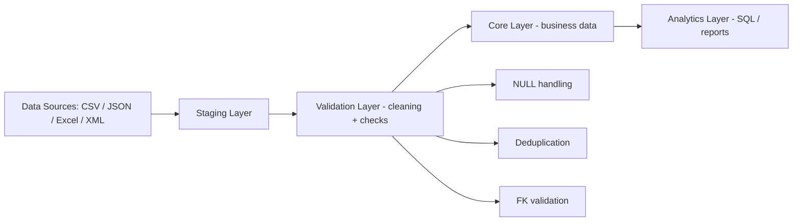
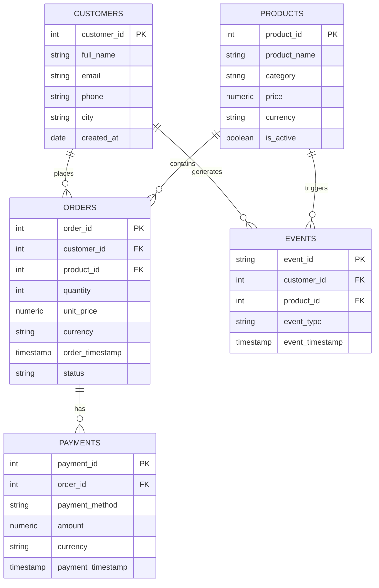

# ETL Pipeline

## Описание проекта

Проект реализует ETL-пайплайн на Python для загрузки данных из файлов (CSV, JSON, Excel, XML) в PostgreSQL с разделением на staging и core слои.

---

## Архитектура ETL пайплайна


## Слои данных

### Staging
- сырые данные

### Core
- очищенные данные
- бизнес-правила
- проверка FK

---

## ETL процесс

### Staging
- загрузка файлов в staging таблицы
- TRUNCATE перед загрузкой

### Core
- чтение staging
- clean_* функции
- фильтрация FK
- загрузка в core

---

## ER Diagram (Core Layer)


---

## Запуск проекта

### 1. Установить зависимости
```bash
pip install -r requirements.txt
```
### 2. Создать `.env`

```env
DB_USER=...
DB_PASSWORD=...
DB_IP=...
DB_PORT=...
DB_NAME=...
```
3. Запуск
Проект запускается через единый входной файл:
```bash
python main.py
```
## Структура проекта

```text
project/
├── data/
├── ddl/
├── dml/
├── sql/
├── src/
├── .gitignore
└── README.md
├── requirements.txt
```
---
